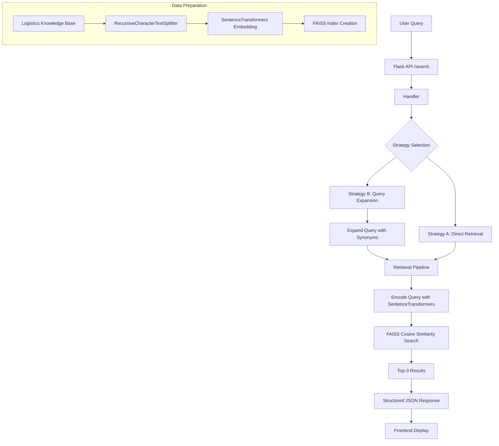

# Teleport Logistics Semantic RAG & Vector Search

## Project Overview

This project implements a local Retrieval-Augmented Generation (RAG) pipeline focused on semantic search for logistics knowledge base. It demonstrates two retrieval strategies: Raw Vector Search and AI-Enhanced Retrieval with query expansion, aligned with the Senior Gen AI Assessment requirements.

The backend provides a REST API for querying the logistics knowledge base, while the frontend offers a simple React interface for user interaction.

## Architecture Overview

The application follows a modular architecture with clear separation of concerns:

### Backend Architecture

```
[User Query] → [Flask API] → [Handler] → [Query Expansion (Strategy B) / Direct (Strategy A)] → [RAG Pipeline] → [FAISS Vector DB] → [Results]
```

### Data Flow

1. **Data Ingestion**: Logistics knowledge base text is loaded and split into chunks using LangChain's RecursiveCharacterTextSplitter.
2. **Embedding Generation**: Chunks are encoded using SentenceTransformers (all-MiniLM-L6-v2) to simulate Vertex AI's textembedding-gecko.
3. **Vector Storage**: Embeddings are stored in FAISS (Facebook AI Similarity Search) for efficient similarity search.
4. **Query Processing**:
   - **Strategy A (Raw Vector Search)**: Direct embedding of user query and cosine similarity search.
   - **Strategy B (AI-Enhanced Retrieval)**: Query expansion using rule-based synonym addition before embedding and search.
5. **Benchmarking**: Both strategies return top-3 results with scores for comparison.

### Architecture Diagram



## Project Structure

```
Teleport_Assignement/
├── backend/
│   ├── main.py                 # Flask application entry point
│   ├── requirements.txt        # Python dependencies
│   ├── .env                    # Environment variables
│   ├── api/
│   │   └── endpoints.py        # API routes (/search)
│   ├── config/
│   │   └── config.py           # Configuration loading
│   ├── docs/
│   │   └── logistics_knowledge_base.txt  # Knowledge base data
│   └── pkg/
│       ├── handler/
│       │   └── handler.py      # Request handling logic
│       └── services/
│           ├── query_expansion.py  # Query expansion service
│           └── rag_pipeline.py     # RAG pipeline implementation
├── frontend/
│   ├── package.json            # Node.js dependencies and scripts
│   ├── public/
│   │   ├── index.html
│   │   └── ...
│   └── src/
│       ├── App.js              # Main React component
│       └── ...
└── README.md                   # This file
```

## Backend Details

### Core Components

- **main.py**: Initializes Flask app with CORS support and registers API blueprint.
- **api/endpoints.py**: Defines `/api/search` POST endpoint for queries.
- **config/config.py**: Loads environment variables, sets PORT and GEMINI_API_KEY.
- **pkg/handler/handler.py**: Orchestrates both retrieval strategies and formats comparison response.
- **pkg/services/query_expansion.py**: Implements rule-based query expansion with logistics-specific synonyms.
- **pkg/services/rag_pipeline.py**: Manages data ingestion, embedding generation, FAISS indexing, and retrieval.

### Technologies Used

- **Flask**: Lightweight web framework for API
- **FAISS**: Efficient vector similarity search
- **SentenceTransformers**: Local embedding model (all-MiniLM-L6-v2)
- **LangChain**: Text splitting utilities
- **NumPy**: Numerical operations for embeddings

## Frontend Details

The frontend is a minimal React application that provides a simple interface to interact with the backend API. It includes basic components for query input and result display.

### Technologies Used

- **React**: UI framework
- **React Scripts**: Build and development tools

## Setup Instructions

### Prerequisites

- Python 3.8+
- Node.js 14+
- Git

### Environment Setup

1. Clone the repository:
   ```bash
   git clone <repository-url>
   ```

2. Initialize Backend Environment:
   ```bash
   cd backend
   # Create .env file
   cp .env.example .env
   ```

   Edit `.env` file:
   ```
   PORT=5000
   GEMINI_API_KEY=your_actual_gemini_api_key_here
   ```

3. Install Backend Dependencies:
   ```bash
   pip install -r requirements.txt
   ```

4. Initialize Frontend Environment:
   ```bash
   cd ../frontend
   npm install
   ```

### Running the Application

1. Start Backend:
   ```bash
   cd backend
   python main.py
   ```
   The backend will run on http://localhost:5000

2. Start Frontend (in a new terminal):
   ```bash
   cd frontend
   npm start
   ```
   The frontend will run on http://localhost:3000

## Usage

1. Open the frontend in your browser (http://localhost:3000)
2. Enter a query related to logistics (e.g., "How does the system handle peak load?")
3. The application will return results from both retrieval strategies for comparison

### API Usage

Send POST requests to `http://localhost:5000/api/search` with JSON body:
```json
{
  "query": "How does the system handle peak load?"
}
```

Response format:
```json
{
  "query": "How does the system handle peak load?",
  "result": [
    {
      "type": "regular_result",
      "response": [
        {"query": "chunk text", "rank": 1, "score": 0.85},
        ...
      ]
    },
    {
      "type": "expanded_result",
      "response": [
        {"query": "chunk text", "rank": 1, "score": 0.82},
        ...
      ]
    }
  ]
}
```

## Benchmarking

The application automatically compares two retrieval strategies:

- **Strategy A (Raw Vector Search)**: Direct embedding-based similarity search using cosine similarity.
- **Strategy B (AI-Enhanced Retrieval)**: Query expansion with synonyms before embedding and search.

Results include top-3 chunks with similarity scores for each strategy, enabling evaluation of retrieval quality improvements through query expansion.

### Technical Requirements Met

1. **Embedding Model**: Uses SentenceTransformers (all-MiniLM-L6-v2) to simulate Vertex AI's textembedding-gecko behavior.

2. **Vector Database**: Implements FAISS for lightweight local vector storage and search.

3. **Mocking**: Query expansion uses rule-based synonym addition instead of actual LLM calls, simulating AI-enhanced retrieval.

4. **Orchestration**: Python classes manage data ingestion from the logistics knowledge base text file.

### Benchmarking Task

The `/api/search` endpoint outputs structured JSON comparing both strategies for each query, showing:
- Original query
- Top 3 chunks from Strategy A with similarity scores
- Top 3 chunks from Strategy B (after query expansion) with similarity scores

### Similarity Metric Choice

**Cosine Similarity**: Chosen over Euclidean distance because:
- Embeddings are normalized, making cosine similarity equivalent to dot product
- Cosine similarity measures angular distance, better suited for high-dimensional semantic embeddings
- More robust to vector magnitude differences
- Standard choice for text similarity in NLP applications

### Production Migration Path

To migrate to Vertex AI Vector Search (Matching Engine):
1. Replace SentenceTransformers with Vertex AI TextEmbeddingModel
2. Use Vertex AI Vector Search for indexing and querying
3. Implement actual LLM-based query expansion using GenerativeModel
4. Deploy on GCP with proper authentication and monitoring

### Repository Contents

- **Source Code**: Modular Python files in `backend/pkg/` for embedding, storage, and retrieval
- **Tests**: Pytest suites can be added in `backend/tests/`
- **Dev Evidence**: Benchmarking results available via API calls
- **Documentation**: This README explains implementation choices and migration strategy

## Contributing

1. Fork the repository
2. Create a feature branch
3. Make changes with proper testing
4. Submit a pull request
